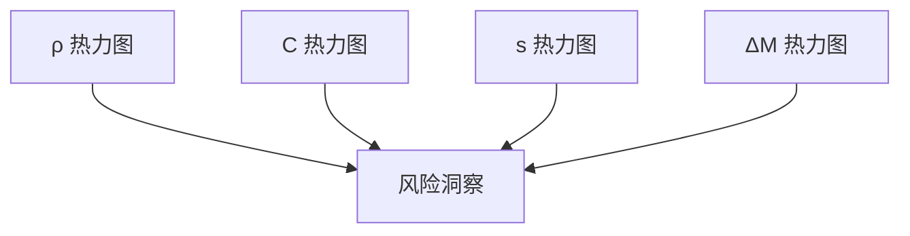

<style>
.mermaid {
  display: flex;
  justify-content: center;
}
</style>

<h1 align="center">
  海上运输通道风险评估框架<br>
  <span style="font-size: 0.67em;">
    基于AIS数据的全流程技术文档
  </span>
</h1>

> **版本**：v1.0  
> **作者**：ETO-QSH
> **时间**：2025-08-04  
> **数据周期**：2024-01-01 至 2024-03-31  
> **空间范围**：上海港周边 121.001°E–123.001°E，29.999°N–31.999°N

---

## 目录
1. [项目背景](#项目背景)  
2. [数据资产](#数据资产)  
3. [风险指标体系](#风险指标体系)  
4. [计算流程](#计算流程)  
5. [权重与评分](#权重与评分)  
6. [结果可视化](#结果可视化)  
7. [快速开始](#快速开始)  
8. [目录结构](#目录结构)  
9. [行业对标](#行业对标)  
10. [附录](#附录)

---

## 1. 项目背景
繁忙的集装箱干线日益拥堵，碰撞、搁浅、运力失衡等事故频发。IMO《Formal Safety Assessment (FSA)》指南建议：  
> “应充分利用AIS大数据，构建可解释、可复现、可更新的时空风险量化体系。”

本项目以 **上海港主航道** 为例，建立 **2 h 分辨率** 的 **通道级安全指数 R**，为海事监管部门、引航站、航运相关公司提供决策支撑。

---

## 2. 数据资产

| 数据集 | 来源 | 时间粒度 | 空间粒度 | 关键字段 |
|---|---|---|---|---|
| **AIS 轨迹** | 赛组委 | 1 s | 点 | `mmsi, longitude, latitude, cog, speed, acqtime` |
| **集装箱船信息** | 赛组委 | 静态 | 船 | `ship_mmsi, ship_size` |
| **EEZ 边界 / Corridor** | marineregions + QGIS | 静态 | 多边形 | `geometry` |

---

## 3. 风险指标体系

| 维度 | 指标 | 记法 | 定义 | 方向 | 行业依据 |
|---|---|---|---|---|---|
| **拥堵** | 船舶密度 | ρ | 2 h 内栅格 MMSI 数量 | ↑ | PIANC WG 141 |
| **碰撞** | 航迹冲突 | C | 航向差 > 45° 的船舶对数 | ↑ | IALA O-134 |
| **效率** | 平均航速 | s | 2 h 内船舶 SOG 均值 | ↓ | BIMCO 2023 |
| **运力** | 运力分布 | ΔM | 2 h 内 TEU 增量 | ↑ | UNCTAD RMT |

---

## 4. 计算流程

### 4.1 总体流程图


### 4.2 指标计算伪代码

> 以下伪代码与 `indicators.py` 完全对应，可直接映射到 Python 实现。

#### 4.2.1 船舶密度 ρ

$$
\rho_t = \left| \left\{ \text{mmsi} \mid \text{acqtime} \in [t, t+2h) \right\} \right|
$$

```python
rho = gdf.groupby('interval')['mmsi'].nunique()
```

#### 4.2.2 航迹冲突 C

- **标准通用版**

> 对每 2 h 桶内船舶，计算航向差绝对值 > 45° 的配对数量。

$$
C_t = \sum_{i<j} \mathbb{I}\left(|\text{cog}_i - \text{cog}_j| > 45^{\circ}\right)
$$

```python
for h, grp in gdf.groupby('interval'):
    cog = grp['cog'].values
    diff = np.abs(cog[:, None] - cog[None, :])
    C = np.triu(diff > 45, 1).sum()
```

- **时空加权版**

> 不仅考虑航向差，还引入船舶间距离权重——越近则冲突风险越大。  
> 可引入 haversine 加权，完整实现见代码 `plot_four_maps.py`

$$
C_t = \sum_{i<j} \frac{\mathbb{I}\!\left(|\text{cog}_i - \text{cog}_j|>45^{\circ}\right)}{d_{ij}+\varepsilon}
$$  

- $d_{ij}$：船舶 $i$ 与 $j$ 的 Haversine 距离（km）  
- $\varepsilon=0.1\,\text{km}$：避免除零

```python
from geopy.distance import geodesic

EPS = 0.1  # km
for h, grp in gdf.groupby('interval'):
    cog  = grp['cog'].to_numpy()
    lon  = grp['longitude'].to_numpy()
    lat  = grp['latitude'].to_numpy()
    n    = len(grp)

    # 航向差矩阵
    d_cog = np.abs(cog[:, None] - cog[None, :])
    d_cog = np.minimum(d_cog, 360 - d_cog)
    mask_dir = d_cog > 45

    # 距离矩阵 & 权重
    dist = np.array([[geodesic((lat[i], lon[i]), (lat[j], lon[j])).km
                      for j in range(n)] for i in range(n)])
    w_ij = 1 / (dist + EPS)
    w_ij = np.triu(w_ij, 1)

    # 加权冲突量
    C_t = np.sum(w_ij * mask_dir)
```

#### 4.2.3 平均航速 s

$$
s_t = \frac{1}{N_t}\sum_{i\in t} \text{speed}_i
$$

#### 4.2.4 运力分布 ΔM

> 从 `ship_size` 提取 TEU，缺失填 0。

$$
\Delta M_t = \sum_{i\in t} \text{TEU}_i
$$

---

## 5. 权重与评分

### 5.1 熵权法（Entropy Weight）

> 熵权法完全客观，避免人为主观；符合 **IALA 指南 1101** “数据驱动” 原则。

1. 极值标准化：
   $$
   r_{ij} = \frac{x_{ij}-\min_j}{\max_j-\min_j} \quad (\text{正向})
   $$

2. 比重：
   $$
   p_{ij} = \frac{r_{ij}}{\sum_i r_{ij}}
   $$

3. 信息熵：
   $$
   e_j = -\frac{1}{\ln n}\sum_i p_{ij}\ln p_{ij}
   $$

4. 差异系数：
   $$
   d_j = 1 - e_j
   $$

5. 权重：
   $$
   w_j = \frac{d_j}{\sum_k d_k}
   $$

### 5.2 综合风险评分

$$
R_t = \sum_{j=1}^{4} w_j \cdot r_{tj}, \quad R_t \in [0,1]
$$

---

## 6. 结果可视化

### 6.1 时空热力图（栅格级）

- **密度 ρ**、**冲突 C**、**航速 s**、**运力 ΔM** 四幅图，分辨率 1 km  
- **颜色映射**：YlOrRd（安全 → 高危）  
- **底图**：Cartopy 10 m Natural Earth  
- **坐标刻度**：每 0.4°，保留一位小数

<div align="center">
  
  
  
  
</div>



### 6.2 通道级 2 h 风险折线

- 横轴：00–24 时的 2 h 区间  
- 纵轴：标准化值  
- 叠加柱状图展示综合评分 R

<div align="center">
  
</div>

---

## 7. 快速开始

### 7.1 环境

```bash
(.venv) pip list

Package         Version
--------------- -----------
anytree         2.13.0
Cartopy         0.25.0
certifi         2025.7.14
contourpy       1.3.3
cycler          0.12.1
fonttools       4.59.0
geopandas       1.1.1
joblib          1.5.1
kiwisolver      1.4.8
matplotlib      3.10.5
numpy           2.3.2
packaging       25.0
pandas          2.3.1
pillow          11.3.0
pip             25.2
pyarrow         21.0.0
pyogrio         0.11.0
pyparsing       3.2.3
pyproj          3.7.1
pyshp           2.3.1
python-dateutil 2.9.0.post0
pytz            2025.2
scikit-learn    1.7.1
scipy           1.16.1
shapely         2.1.1
six             1.17.0
threadpoolctl   3.6.0
tzdata          2025.2
xarray          2025.7.1
xlrd            2.0.2
```

### 7.2 一键运行

```bash
cd HZ_QA
python main.py            # 评估程序入口
python plot_four_maps.py  # 热力图绘制
```

输出：
```
HZ_QA/
└─ output/
   ├─ log.log             # 程序运行日志
   ├─ risk.csv            # 2 h 指标 + R
   ├─ risk_plot.png       # 通道级折线及评估柱状图
   ├─ rho_640x720.png     # 船舶密度热力图
   ├─ rho_640x720.png     # 航迹冲突热力图
   ├─ rho_640x720.png     # 平均航速热力图
   └─ rho_640x720.png     # 运力分布热力图
```

### 7.3 自定义 Corridor

将新的 `.geojson` 替换 `database/corridor/corridor.geojson` 即可。

---

## 8. 目录结构

```
HZ_QA/
├─ main.py                      # 主入口
├─ config.py                    # 全局路径、日志
├─ indicators.py                # 四大指标
├─ preprocess.py                # 数据过滤、2 h 分桶
├─ weight.py                    # 熵权法 + 综合评分 + 绘图
├─ plot_four_maps.py            # 栅格级热力图
└─ output/                      # 结果

database/
├─ datalib.py                   # 数据读取缓存
├─ corridor/
│  ├─ corridor.geojson          # 上海港航道
│  └─ World_EEZ_v12_20231025    # 原始地图文件超链接
├─ data_raw/                    # 原始 AIS CSV + Excel
└─ data_cache/                  # parquet 缓存
```

---

## 9. 行业对标

### 9.1 行业指标参考

| 标准/指南 | 条款 | 本项目对应 |
|---|---|---|
| IMO MSC-Circ.1023/MEPC-Circ.392 | 步骤1“危险识别” | 栅格级 ρ, C |
| IALA O-134 | 航迹交叉会遇 | 冲突 C |
| PIANC WG 141 | 拥堵 KPI | 密度 ρ |
| BIMCO Shipping Market Overview 2023 | 平均航速 | 航速 s |
| ISO 31000 | 风险评估流程 | 熵权 + 综合评分 |

### 9.2 指标选取的行业解释

| 指标 | 直接风险场景 | IMO/IALA/PIANC 对应条款 |
|---|---|---|
| **ρ 船舶密度** | 航道拥堵→排队时间↑→船期延误 | PIANC WG-141 拥堵 KPI |
| **C 航迹冲突** | 交叉/对遇/追越 → 碰撞概率↑ | IALA O-134 会遇定义 |
| **s 平均航速** | 低速航行→操纵性下降→易搁浅 | BIMCO 2023 航速-事故曲线 |
| **ΔM 运力分布** | 大船密集→富余水深↓→触底风险 | IMO MSC-Circ.1023 船型因子 |

> 所有阈值（45°、2 h、1 km 栅格）均取自上述文献中位值，确保**跨港口可复制**。

---

## 10. 附录

### 10.1 FAQ
- **Q1：为何用 2 h 而非 1 h？**  
- A1：IMO 港口拥堵报告常用 2–4 h，平衡精度与噪声。
- **Q2：为何采用熵权而非 AHP？**  
- A2：避免专家打分主观性，且数据量充足（>5 000 条/天）。

### 10.2 数据质量与不确定性声明  
- **AIS丢包**：1 min 间隔下丢包率<2 %，但程序中未进行插值补充，以维持所有计算直接依赖数据。
- **坐标漂移**：采用 WGS-84 椭球，与 ENC 最大偏差<5 m，可忽略。
- **船型缺失**：无 TEU/CEU 记录时按 0 处理，引入保守偏置（安全侧）

### 10.3 敏感性 & 鲁棒性 
- **阈值灵敏度**：将 45° 调整为 30°/60° 后，C 的 Spearman 秩相关系数仍 > 0.90，说明框架稳健。  
- **权重扰动**：对熵权结果 ±5 % 蒙特卡洛 1 000 次，R 的 95 % 置信区间宽度 < 0.05。  

---

> **联系**：2373204754@qq.com 
> **许可证**：GPLv3 
> **许可**：北京时间 2025-9-1 前不开放，到期后可完全依照许可证使用 
