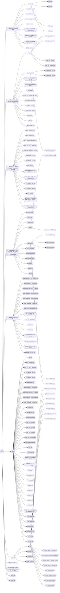

``` mermaid
graph LR
    52HZ_710273[( 52HZ )]
    1_原油贸易_成品油贸易数据_f809ea[[1、原油贸易、成品油贸易数据]]
    52HZ_710273 --> 1_原油贸易_成品油贸易数据_f809ea
    timeline_000011[[timeline]]
    1_原油贸易_成品油贸易数据_f809ea --> timeline_000011
    中国_png_d54954([中国.png])
    timeline_000011 --> 中国_png_d54954
    中国_svg_66bf8c([中国.svg])
    timeline_000011 --> 中国_svg_66bf8c
    欧洲_png_238bb3([欧洲.png])
    timeline_000011 --> 欧洲_png_238bb3
    欧洲_svg_947ec9([欧洲.svg])
    timeline_000011 --> 欧洲_svg_947ec9
    China_Refinery_csv_53793a([China_Refinery.csv])
    1_原油贸易_成品油贸易数据_f809ea --> China_Refinery_csv_53793a
    China_Refinery_png_0f1adb([China_Refinery.png])
    1_原油贸易_成品油贸易数据_f809ea --> China_Refinery_png_0f1adb
    china_refinery_index_py_ee5bf1([china_refinery_index.py])
    1_原油贸易_成品油贸易数据_f809ea --> china_refinery_index_py_ee5bf1
    timeline_md_e402da([timeline.md])
    1_原油贸易_成品油贸易数据_f809ea --> timeline_md_e402da
    中国出口成品油海运量_2025_10_17_xls_3418e4([中国出口成品油海运量_2025-10-17.xls])
    1_原油贸易_成品油贸易数据_f809ea --> 中国出口成品油海运量_2025_10_17_xls_3418e4
    中国进口原油海运量_2025_10_17_xls_3d9609([中国进口原油海运量_2025-10-17.xls])
    1_原油贸易_成品油贸易数据_f809ea --> 中国进口原油海运量_2025_10_17_xls_3d9609
    中国进口成品油海运量_2025_10_17_xls_69890d([中国进口成品油海运量_2025-10-17.xls])
    1_原油贸易_成品油贸易数据_f809ea --> 中国进口成品油海运量_2025_10_17_xls_69890d
    产能布局数据_md_6f3253([产能布局数据.md])
    1_原油贸易_成品油贸易数据_f809ea --> 产能布局数据_md_6f3253
    2_航运与船队数据_全球油轮船队构成与货流数据_10fca4[[2、航运与船队数据，全球油轮船队构成与货流数据]]
    52HZ_710273 --> 2_航运与船队数据_全球油轮船队构成与货流数据_10fca4
    plots_709456[[plots]]
    2_航运与船队数据_全球油轮船队构成与货流数据_10fca4 --> plots_709456
    crude_flow_2022_png_6c5d4c([crude_flow_2022.png])
    plots_709456 --> crude_flow_2022_png_6c5d4c
    crude_flow_2023_png_4b1dd3([crude_flow_2023.png])
    plots_709456 --> crude_flow_2023_png_4b1dd3
    crude_flow_2024_png_17c0dc([crude_flow_2024.png])
    plots_709456 --> crude_flow_2024_png_17c0dc
    crude_flow_combined_png_9f6afe([crude_flow_combined.png])
    plots_709456 --> crude_flow_combined_png_9f6afe
    sankey_text_ed305a[[sankey_text]]
    2_航运与船队数据_全球油轮船队构成与货流数据_10fca4 --> sankey_text_ed305a
    crude_sankey_2022_txt_4677a0([crude_sankey_2022.txt])
    sankey_text_ed305a --> crude_sankey_2022_txt_4677a0
    crude_sankey_2023_txt_646c58([crude_sankey_2023.txt])
    sankey_text_ed305a --> crude_sankey_2023_txt_646c58
    crude_sankey_2024_txt_e57e68([crude_sankey_2024.txt])
    sankey_text_ed305a --> crude_sankey_2024_txt_e57e68
    2022_2024内贸成品油货流分析_xlsx_3b8118([2022-2024内贸成品油货流分析.xlsx])
    2_航运与船队数据_全球油轮船队构成与货流数据_10fca4 --> 2022_2024内贸成品油货流分析_xlsx_3b8118
    2022_2024原油全球货流分析_xlsx_48266a([2022-2024原油全球货流分析.xlsx])
    2_航运与船队数据_全球油轮船队构成与货流数据_10fca4 --> 2022_2024原油全球货流分析_xlsx_48266a
    AGCOFOP_py_f40705([AGCOFOP.py])
    2_航运与船队数据_全球油轮船队构成与货流数据_10fca4 --> AGCOFOP_py_f40705
    country_flow_analysis_with_pct_csv_b48f4c([country_flow_analysis_with_pct.csv])
    2_航运与船队数据_全球油轮船队构成与货流数据_10fca4 --> country_flow_analysis_with_pct_csv_b48f4c
    crude_flow_combined_py_4390df([crude_flow_combined.py])
    2_航运与船队数据_全球油轮船队构成与货流数据_10fca4 --> crude_flow_combined_py_4390df
    crude_oil_flow_json_a07fd1([crude_oil_flow.json])
    2_航运与船队数据_全球油轮船队构成与货流数据_10fca4 --> crude_oil_flow_json_a07fd1
    crude_sankey_top60_txt_e99ceb([crude_sankey_top60.txt])
    2_航运与船队数据_全球油轮船队构成与货流数据_10fca4 --> crude_sankey_top60_txt_e99ceb
    sankey_py_f3bc10([sankey.py])
    2_航运与船队数据_全球油轮船队构成与货流数据_10fca4 --> sankey_py_f3bc10
    test_py_95ec3e([test.py])
    2_航运与船队数据_全球油轮船队构成与货流数据_10fca4 --> test_py_95ec3e
    油轮船舶档案_csv_4db60f([油轮船舶档案.csv])
    2_航运与船队数据_全球油轮船队构成与货流数据_10fca4 --> 油轮船舶档案_csv_4db60f
    3_油运市场上中_欧航线相关分航线_分船型的价格指数或价格_be5e67[[3、油运市场上中、欧航线相关分航线、分船型的价格指数或价格]]
    52HZ_710273 --> 3_油运市场上中_欧航线相关分航线_分船型的价格指数或价格_be5e67
    BDTI_2025_10_17_xls_49bc6f([BDTI_2025-10-17.xls])
    3_油运市场上中_欧航线相关分航线_分船型的价格指数或价格_be5e67 --> BDTI_2025_10_17_xls_49bc6f
    BDTI_AllRoutes_png_821825([BDTI_AllRoutes.png])
    3_油运市场上中_欧航线相关分航线_分船型的价格指数或价格_be5e67 --> BDTI_AllRoutes_png_821825
    BDTI_AllRoutes_Weighted_csv_8a361d([BDTI_AllRoutes_Weighted.csv])
    3_油运市场上中_欧航线相关分航线_分船型的价格指数或价格_be5e67 --> BDTI_AllRoutes_Weighted_csv_8a361d
    BDTI_CN_vs_EU_Routes_png_92772e([BDTI_CN_vs_EU_Routes.png])
    3_油运市场上中_欧航线相关分航线_分船型的价格指数或价格_be5e67 --> BDTI_CN_vs_EU_Routes_png_92772e
    BDTI_China_vs_Europe_index_py_e86c97([BDTI_China_vs_Europe_index.py])
    3_油运市场上中_欧航线相关分航线_分船型的价格指数或价格_be5e67 --> BDTI_China_vs_Europe_index_py_e86c97
    BDTI_Monthly_Avg_csv_490a6d([BDTI_Monthly_Avg.csv])
    3_油运市场上中_欧航线相关分航线_分船型的价格指数或价格_be5e67 --> BDTI_Monthly_Avg_csv_490a6d
    BDTI_Monthly_Avg_png_284828([BDTI_Monthly_Avg.png])
    3_油运市场上中_欧航线相关分航线_分船型的价格指数或价格_be5e67 --> BDTI_Monthly_Avg_png_284828
    BDTI_index_py_c4c288([BDTI_index.py])
    3_油运市场上中_欧航线相关分航线_分船型的价格指数或价格_be5e67 --> BDTI_index_py_c4c288
    BDTI分航线运价指数_对应运输航线_docx_f3fc22([BDTI分航线运价指数-对应运输航线.docx])
    3_油运市场上中_欧航线相关分航线_分船型的价格指数或价格_be5e67 --> BDTI分航线运价指数_对应运输航线_docx_f3fc22
    BDTI分航线运价指数_日__2025_10_17_xls_3954f7([BDTI分航线运价指数（日）_2025-10-17.xls])
    3_油运市场上中_欧航线相关分航线_分船型的价格指数或价格_be5e67 --> BDTI分航线运价指数_日__2025_10_17_xls_3954f7
    CTFI_Monthly_Avg_csv_a18394([CTFI_Monthly_Avg.csv])
    3_油运市场上中_欧航线相关分航线_分船型的价格指数或价格_be5e67 --> CTFI_Monthly_Avg_csv_a18394
    CTFI_Monthly_Avg_png_bead80([CTFI_Monthly_Avg.png])
    3_油运市场上中_欧航线相关分航线_分船型的价格指数或价格_be5e67 --> CTFI_Monthly_Avg_png_bead80
    CTFI_index_py_56eb36([CTFI_index.py])
    3_油运市场上中_欧航线相关分航线_分船型的价格指数或价格_be5e67 --> CTFI_index_py_56eb36
    _海上丝绸之路_进口原油运价指数_分航线__2025_10_17_xls_14c69a(['海上丝绸之路'进口原油运价指数（分航线）_2025-10-17.xls])
    3_油运市场上中_欧航线相关分航线_分船型的价格指数或价格_be5e67 --> _海上丝绸之路_进口原油运价指数_分航线__2025_10_17_xls_14c69a
    中国进口原油运价指数_2025_10_17_xls_3e7d7b([中国进口原油运价指数_2025-10-17.xls])
    3_油运市场上中_欧航线相关分航线_分船型的价格指数或价格_be5e67 --> 中国进口原油运价指数_2025_10_17_xls_3e7d7b
    4_MR型成品油轮_阿芙拉型成品油轮_VLCC油轮_2020年_2024年_每年1_3月的船舶轨迹数据_012008[[4、MR型成品油轮、阿芙拉型成品油轮、VLCC油轮，2020年-2024年，每年1-3月的船舶轨迹数据]]
    52HZ_710273 --> 4_MR型成品油轮_阿芙拉型成品油轮_VLCC油轮_2020年_2024年_每年1_3月的船舶轨迹数据_012008
    MR型成品油轮_901b8d[[MR型成品油轮]]
    4_MR型成品油轮_阿芙拉型成品油轮_VLCC油轮_2020年_2024年_每年1_3月的船舶轨迹数据_012008 --> MR型成品油轮_901b8d
    VLCC油轮_23ff65[[VLCC油轮]]
    4_MR型成品油轮_阿芙拉型成品油轮_VLCC油轮_2020年_2024年_每年1_3月的船舶轨迹数据_012008 --> VLCC油轮_23ff65
    data_cache_dd03a9[[data_cache]]
    4_MR型成品油轮_阿芙拉型成品油轮_VLCC油轮_2020年_2024年_每年1_3月的船舶轨迹数据_012008 --> data_cache_dd03a9
    output_bfc545[[output]]
    4_MR型成品油轮_阿芙拉型成品油轮_VLCC油轮_2020年_2024年_每年1_3月的船舶轨迹数据_012008 --> output_bfc545
    heatmap_cartopy_2020_png_608845([heatmap_cartopy_2020.png])
    output_bfc545 --> heatmap_cartopy_2020_png_608845
    heatmap_raw_2020_png_3ac6ff([heatmap_raw_2020.png])
    output_bfc545 --> heatmap_raw_2020_png_3ac6ff
    test_output_24a2bf[[test_output]]
    4_MR型成品油轮_阿芙拉型成品油轮_VLCC油轮_2020年_2024年_每年1_3月的船舶轨迹数据_012008 --> test_output_24a2bf
    test_rgb_2020_png_98b85c([test_rgb_2020.png])
    test_output_24a2bf --> test_rgb_2020_png_98b85c
    test_rgb_2021_png_1c6bca([test_rgb_2021.png])
    test_output_24a2bf --> test_rgb_2021_png_1c6bca
    test_rgb_2022_png_623565([test_rgb_2022.png])
    test_output_24a2bf --> test_rgb_2022_png_623565
    test_rgb_2023_png_13735d([test_rgb_2023.png])
    test_output_24a2bf --> test_rgb_2023_png_13735d
    test_rgb_2024_png_e6f996([test_rgb_2024.png])
    test_output_24a2bf --> test_rgb_2024_png_e6f996
    阿芙拉型成品油轮_c0fb30[[阿芙拉型成品油轮]]
    4_MR型成品油轮_阿芙拉型成品油轮_VLCC油轮_2020年_2024年_每年1_3月的船舶轨迹数据_012008 --> 阿芙拉型成品油轮_c0fb30
    background_map_png_8a1605([background_map.png])
    4_MR型成品油轮_阿芙拉型成品油轮_VLCC油轮_2020年_2024年_每年1_3月的船舶轨迹数据_012008 --> background_map_png_8a1605
    background_map_py_f24ca2([background_map.py])
    4_MR型成品油轮_阿芙拉型成品油轮_VLCC油轮_2020年_2024年_每年1_3月的船舶轨迹数据_012008 --> background_map_py_f24ca2
    datalib_py_3b65ed([datalib.py])
    4_MR型成品油轮_阿芙拉型成品油轮_VLCC油轮_2020年_2024年_每年1_3月的船舶轨迹数据_012008 --> datalib_py_3b65ed
    heatmap_py_66cc96([heatmap.py])
    4_MR型成品油轮_阿芙拉型成品油轮_VLCC油轮_2020年_2024年_每年1_3月的船舶轨迹数据_012008 --> heatmap_py_66cc96
    test_py_cd963a([test.py])
    4_MR型成品油轮_阿芙拉型成品油轮_VLCC油轮_2020年_2024年_每年1_3月的船舶轨迹数据_012008 --> test_py_cd963a
    5_主要油轮船型的市场价格_c0333d[[5、主要油轮船型的市场价格]]
    52HZ_710273 --> 5_主要油轮船型的市场价格_c0333d
    Newbuilding_Price_and_UnitPrice_csv_aa3fd1([Newbuilding_Price_and_UnitPrice.csv])
    5_主要油轮船型的市场价格_c0333d --> Newbuilding_Price_and_UnitPrice_csv_aa3fd1
    Newbuilding_Price_by_Type_png_d5d278([Newbuilding_Price_by_Type.png])
    5_主要油轮船型的市场价格_c0333d --> Newbuilding_Price_by_Type_png_d5d278
    Newbuilding_UnitPrice_by_Type_png_b65d07([Newbuilding_UnitPrice_by_Type.png])
    5_主要油轮船型的市场价格_c0333d --> Newbuilding_UnitPrice_by_Type_png_b65d07
    Ship_Depreciation_Rate_Monthly_csv_e79697([Ship_Depreciation_Rate_Monthly.csv])
    5_主要油轮船型的市场价格_c0333d --> Ship_Depreciation_Rate_Monthly_csv_e79697
    Ship_Depreciation_Rate_Trends_png_0b0a13([Ship_Depreciation_Rate_Trends.png])
    5_主要油轮船型的市场价格_c0333d --> Ship_Depreciation_Rate_Trends_png_0b0a13
    Tanker_Price_Index_Compare_png_d5ca6c([Tanker_Price_Index_Compare.png])
    5_主要油轮船型的市场价格_c0333d --> Tanker_Price_Index_Compare_png_d5ca6c
    Tanker_Price_Index_Monthly_csv_913c73([Tanker_Price_Index_Monthly.csv])
    5_主要油轮船型的市场价格_c0333d --> Tanker_Price_Index_Monthly_csv_913c73
    VLCC二手售价_周__2025_10_17_xls_0e35d8([VLCC二手售价（周）_2025-10-17.xls])
    5_主要油轮船型的市场价格_c0333d --> VLCC二手售价_周__2025_10_17_xls_0e35d8
    new_ship_USD_DWT_py_3a6fc1([new_ship_USD_DWT.py])
    5_主要油轮船型的市场价格_c0333d --> new_ship_USD_DWT_py_3a6fc1
    old_ship_py_aac42c([old_ship.py])
    5_主要油轮船型的市场价格_c0333d --> old_ship_py_aac42c
    sspi_csi_py_eb565e([sspi_csi.py])
    5_主要油轮船型的市场价格_c0333d --> sspi_csi_py_eb565e
    二手油船价格指数_2025_10_17_xls_0dbb5d([二手油船价格指数_2025-10-17.xls])
    5_主要油轮船型的市场价格_c0333d --> 二手油船价格指数_2025_10_17_xls_0dbb5d
    二手船价格_2025_10_17_xls_210e83([二手船价格_2025-10-17.xls])
    5_主要油轮船型的市场价格_c0333d --> 二手船价格_2025_10_17_xls_210e83
    新油船价格指数_2025_10_17_xls_cb0c9e([新油船价格指数_2025-10-17.xls])
    5_主要油轮船型的市场价格_c0333d --> 新油船价格指数_2025_10_17_xls_cb0c9e
    新船价格_2025_10_17_xls_438da6([新船价格_2025-10-17.xls])
    5_主要油轮船型的市场价格_c0333d --> 新船价格_2025_10_17_xls_438da6
    report_8663c0[[report]]
    52HZ_710273 --> report_8663c0
    AIS_gif_26c499([AIS.gif])
    report_8663c0 --> AIS_gif_26c499
    BDTI_AllRoutes_png_e21520([BDTI_AllRoutes.png])
    report_8663c0 --> BDTI_AllRoutes_png_e21520
    BDTI_CN_vs_EU_Routes_png_e3e974([BDTI_CN_vs_EU_Routes.png])
    report_8663c0 --> BDTI_CN_vs_EU_Routes_png_e3e974
    BDTI_Monthly_Avg_png_127fef([BDTI_Monthly_Avg.png])
    report_8663c0 --> BDTI_Monthly_Avg_png_127fef
    CTFI_Monthly_Avg_png_77dc46([CTFI_Monthly_Avg.png])
    report_8663c0 --> CTFI_Monthly_Avg_png_77dc46
    China_Refinery_png_bed16c([China_Refinery.png])
    report_8663c0 --> China_Refinery_png_bed16c
    Newbuilding_Price_by_Type_png_4f0247([Newbuilding_Price_by_Type.png])
    report_8663c0 --> Newbuilding_Price_by_Type_png_4f0247
    Newbuilding_UnitPrice_by_Type_png_9f9a80([Newbuilding_UnitPrice_by_Type.png])
    report_8663c0 --> Newbuilding_UnitPrice_by_Type_png_9f9a80
    Ship_Depreciation_Rate_Trends_png_49dbd3([Ship_Depreciation_Rate_Trends.png])
    report_8663c0 --> Ship_Depreciation_Rate_Trends_png_49dbd3
    Tanker_Price_Index_Compare_png_75a1a4([Tanker_Price_Index_Compare.png])
    report_8663c0 --> Tanker_Price_Index_Compare_png_75a1a4
    WorldMap_png_4934d8([WorldMap.png])
    report_8663c0 --> WorldMap_png_4934d8
    WorldMapLine_png_28063a([WorldMapLine.png])
    report_8663c0 --> WorldMapLine_png_28063a
    background_map_png_9f4518([background_map.png])
    report_8663c0 --> background_map_png_9f4518
    crude_flow_2022_png_ce8133([crude_flow_2022.png])
    report_8663c0 --> crude_flow_2022_png_ce8133
    crude_flow_2023_png_6d1326([crude_flow_2023.png])
    report_8663c0 --> crude_flow_2023_png_6d1326
    crude_flow_2024_png_ab6c35([crude_flow_2024.png])
    report_8663c0 --> crude_flow_2024_png_ab6c35
    crude_flow_combined_png_a4fbee([crude_flow_combined.png])
    report_8663c0 --> crude_flow_combined_png_a4fbee
    crude_sankey_top60_png_968bc8([crude_sankey_top60.png])
    report_8663c0 --> crude_sankey_top60_png_968bc8
    中国_png_6e5e54([中国.png])
    report_8663c0 --> 中国_png_6e5e54
    产能布局数据_md_ec625a([产能布局数据.md])
    report_8663c0 --> 产能布局数据_md_ec625a
    全球油化品贸易流向重塑示意图_png_72ee40([全球油化品贸易流向重塑示意图.png])
    report_8663c0 --> 全球油化品贸易流向重塑示意图_png_72ee40
    北极航线_removebg_preview_png_c67b6c([北极航线-removebg-preview.png])
    report_8663c0 --> 北极航线_removebg_preview_png_c67b6c
    图片1_jpg_6445bc([图片1.jpg])
    report_8663c0 --> 图片1_jpg_6445bc
    扩张规模建议_xls_1c5d12([扩张规模建议.xls])
    report_8663c0 --> 扩张规模建议_xls_1c5d12
    扩张需求_png_258d4a([扩张需求.png])
    report_8663c0 --> 扩张需求_png_258d4a
    数据集_png_c9d0a2([数据集.png])
    report_8663c0 --> 数据集_png_c9d0a2
    方案A_png_803f9f([方案A.png])
    report_8663c0 --> 方案A_png_803f9f
    方案B_png_f3dc5e([方案B.png])
    report_8663c0 --> 方案B_png_f3dc5e
    方案C_png_1d138d([方案C.png])
    report_8663c0 --> 方案C_png_1d138d
    欧洲_png_067962([欧洲.png])
    report_8663c0 --> 欧洲_png_067962
    欧洲产能转移引发的全球油化产业链条重构_pptx_dceeb5([欧洲产能转移引发的全球油化产业链条重构.pptx])
    report_8663c0 --> 欧洲产能转移引发的全球油化产业链条重构_pptx_dceeb5
    红海危机数据_png_5230b7([红海危机数据.png])
    report_8663c0 --> 红海危机数据_png_5230b7
    红海危机机制_png_29ed65([红海危机机制.png])
    report_8663c0 --> 红海危机机制_png_29ed65
    苏伊士运河_png_5ef213([苏伊士运河.png])
    report_8663c0 --> 苏伊士运河_png_5ef213
    苏伊士运河危机_png_fe7e9c([苏伊士运河危机.png])
    report_8663c0 --> 苏伊士运河危机_png_fe7e9c
    运力紧张_png_dda7f1([运力紧张.png])
    report_8663c0 --> 运力紧张_png_dda7f1
    运力过剩_png_3d6e58([运力过剩.png])
    report_8663c0 --> 运力过剩_png_3d6e58
    src_b8ed7b[[src]]
    52HZ_710273 --> src_b8ed7b
    GIS_fe9efe[[GIS]]
    src_b8ed7b --> GIS_fe9efe
    Shipping_Lanes_geojson_c23de9([Shipping_Lanes.geojson])
    GIS_fe9efe --> Shipping_Lanes_geojson_c23de9
    Shipping_Lanes_qmd_448628([Shipping_Lanes.qmd])
    GIS_fe9efe --> Shipping_Lanes_qmd_448628
    Shipping_Lanes_url_b96ffb([Shipping_Lanes.url])
    GIS_fe9efe --> Shipping_Lanes_url_b96ffb
    UpdatedPub150_csv_83805b([UpdatedPub150.csv])
    GIS_fe9efe --> UpdatedPub150_csv_83805b
    UpdatedPub150_url_43f7a4([UpdatedPub150.url])
    GIS_fe9efe --> UpdatedPub150_url_43f7a4
    UpdatedPub150_url_geojson_c12d9e([UpdatedPub150.url.geojson])
    GIS_fe9efe --> UpdatedPub150_url_geojson_c12d9e
    UpdatedPub150_url_qmd_5b0114([UpdatedPub150.url.qmd])
    GIS_fe9efe --> UpdatedPub150_url_qmd_5b0114
    ne_110m_admin_0_countries_url_ef71db([ne_110m_admin_0_countries.url])
    GIS_fe9efe --> ne_110m_admin_0_countries_url_ef71db
    ne_110m_admin_0_countries_url_geojson_9675f6([ne_110m_admin_0_countries.url.geojson])
    GIS_fe9efe --> ne_110m_admin_0_countries_url_geojson_9675f6
    ne_110m_admin_0_countries_url_qmd_bdac74([ne_110m_admin_0_countries.url.qmd])
    GIS_fe9efe --> ne_110m_admin_0_countries_url_qmd_bdac74
    ne_110m_admin_0_countries_zip_ccdd44([ne_110m_admin_0_countries.zip])
    GIS_fe9efe --> ne_110m_admin_0_countries_zip_ccdd44
    ne_110m_ocean_url_cf21e9([ne_110m_ocean.url])
    GIS_fe9efe --> ne_110m_ocean_url_cf21e9
    ne_110m_ocean_url_geojson_4ebd14([ne_110m_ocean.url.geojson])
    GIS_fe9efe --> ne_110m_ocean_url_geojson_4ebd14
    ne_110m_ocean_url_qmd_15da71([ne_110m_ocean.url.qmd])
    GIS_fe9efe --> ne_110m_ocean_url_qmd_15da71
    ne_110m_ocean_zip_78cbc6([ne_110m_ocean.zip])
    GIS_fe9efe --> ne_110m_ocean_zip_78cbc6
    WorldMap_pgw_b9be65([WorldMap.pgw])
    src_b8ed7b --> WorldMap_pgw_b9be65
    WorldMap_png_f55da2([WorldMap.png])
    src_b8ed7b --> WorldMap_png_f55da2
    全球港口分布图_qgz_9409ee([全球港口分布图.qgz])
    src_b8ed7b --> 全球港口分布图_qgz_9409ee
    folder2MermaidTree_py_1fddaf([folder2MermaidTree.py])
    52HZ_710273 --> folder2MermaidTree_py_1fddaf
    _52Hz杯_2025届海事编程马拉松大赛决赛题目_当天发布_1_docx_084cee(['52Hz杯'2025届海事编程马拉松大赛决赛题目（当天发布） （1）.docx])
    52HZ_710273 --> _52Hz杯_2025届海事编程马拉松大赛决赛题目_当天发布_1_docx_084cee
    数据集_md_63df07([数据集.md])
    52HZ_710273 --> 数据集_md_63df07
    数据集_png_4e5a0e([数据集.png])
    52HZ_710273 --> 数据集_png_4e5a0e
```