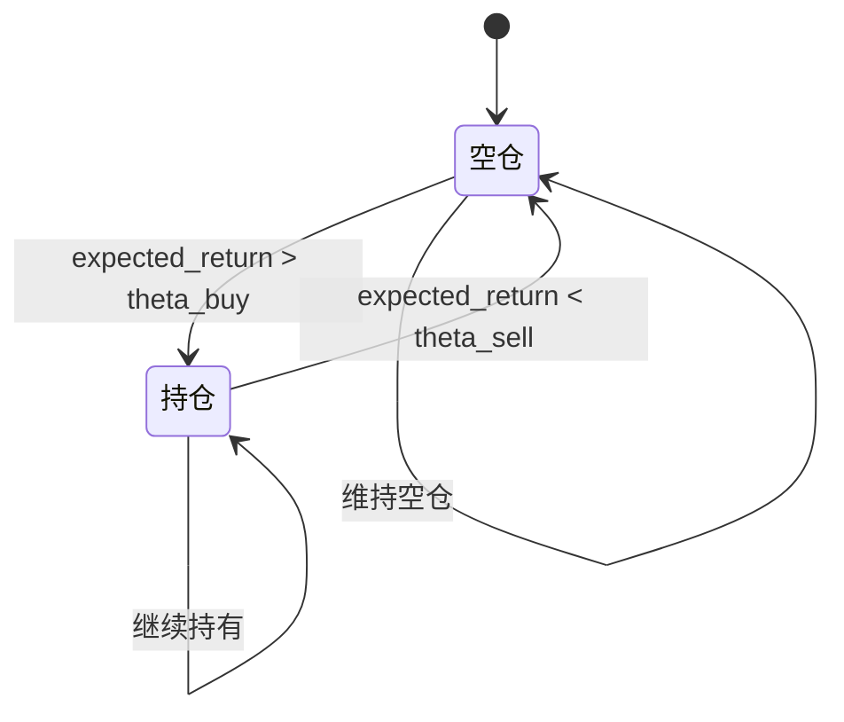
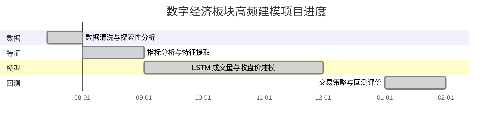

# 完整报告（原文整合版）—— 数字经济板块 5 分钟频率预测与回测

本文档不是摘要，也不是二次改写，而是把 `document/` 目录下的核心 Markdown 内容按主题顺序原样整合到一份总文档中，便于后续直接整理成论文正文、附录或 LaTeX 章节。以下内容尽量保留原文表达、公式、符号与图像引用。

---

## 一、项目执行计划

### 来源文件：`plan.md`

# 量化投资问题 - 项目执行计划

## 一、 项目背景及任务总结
根据《Question.pdf》及原始材料（gpt_ans_1.txt），本项目属于量化投资领域的课题建模。
时间窗口：2021年7月14日至2022年1月28日
研究对象：“数字经济”板块的5分钟级别高频数据
核心考察指标：
1. **指标筛选**：结合宏观经济指标、国内外市场指标、技术指标等，提取与数字经济板块高度相关的关键指标。
2. **成交量预测**：预测板块 5 分钟级别成交量。
3. **收盘价预测**：预测板块 5 分钟收盘价。
4. **策略交易**：基于预测设计高频量化交易策略，并对收益表现进行回测与评价。

## 二、 工作阶段拆解
- [ ] 第一阶：数据处理
  - 读取 `data/raw/database.xlsx` 了解表结构
  - 将所有不同频周期的数据对齐到 5 分钟尺度
  - 处理缺失值（例如采用前向填充处理月度/季度宏观指标）
  - 保存清晰规范的预处理数据至 `data/processed/`
- [ ] 第二阶：参考论文调研与方法总结
  - 分析 `reference` 中的往年优秀论文
  - 从中归纳出具有竞争力和落地价值的特征工程与模型算法
- [ ] 第三阶：特征工程与筛选
  - 构造相关性特征体系（宏观、技术、国内、国际）
  - 进行特征筛选并输出至 `data/feature/`
- [ ] 第四阶：量化模型构建
  - 训练成交量预测模型
  - 训练收盘价预测模型
- [ ] 第五阶：回测与评价
  - 基于模型预测结果编写产生交易信号的逻辑
  - 构建回测引擎（滑点、手续费考虑）并计算夏普比率、最大回撤等指标

## 三、 当前执行步骤
1. 建立 Python 依赖 (`pandas`, `numpy`, `scikit-learn` 等) -> **进行中**
2. 编写脚本解析 `database.xlsx` 结构。

---

## 二、参考论文与工作思路

### 来源文件：`论文思路与工作总结.md`

# 参考论文与工作思路总结

通过对 `reference` 中的优秀论文进行提类分析（例如 2022050200194B_1655091986969.pdf 等），总结其主要建模思路如下：

## 1. 特征工程与指标提取（对应问题一）
- **时间对齐与缺失值处理**：多尺度周期数据往往通过插补或者前向填充（Forward Fill）进行对齐。论文中存在使用拉格朗日插值的做法（在实盘中有未来函数嫌疑，但在以指标平滑估计为诉求的建模题中有一定应用）。本项目目前采用时间线 join 以及前向填充技术解决。
- **降维与特征筛选**：
  - 常规统计方法：进行正态性检验后，灵活采用 Pearson 或 Spearman 相关系数计算各外部指标与数字经济板块五分钟高频“成交量”、“收盘价”的相关性。
  - 机器学习筛选：构建 XGBoost 模型或者 Random Forest，通过输出变量的 Feature Importance（特征重要性，如 Gain、Weight、Cover）进行非线性相关特征提取，选出高贡献特征群。

## 2. 预测模型建模（对应问题二、三）
- **主流模型矩阵**：
  - 机器学习系：**XGBoost**, **LightGBM** （通过引入正则项抵抗过拟合，优势是训练快速、对特征工程的依赖较高）。
  - 深度学习系：**LSTM**, **Transformer / Attention 模型** （优势是捕捉时序依赖与序列模式记忆）。
- **思路设计**：
  - 预测“成交量”与预测“收盘价”是相似的序列回归预测问题。论文里经常将深度学习模型（如 LSTM）和树模型进行对比实验（对比 MSE, MAE, RMSE 评价指标）或者加权融合（Ensemble）。
  - 需要对数据进行**归一化 (MinMaxScaler 或 StandardScaler)**，避免量纲干扰和梯度弥散/爆炸，并严格划分训练集（21.07-21.12）与测试集（22.01）。
  - LSTM 通常会设置 Dropout 甚至 Early Stopping 防止过拟合。

## 3. 量化策略与评估（对应问题四）
- **交易信号**：利用第一步和第二步预测的每 5 分钟收盘价趋势，建立长短（Long/Short）或者是阈值突破交易信号触发机制。
- **回测机制**：结合设定的 0.3% 交易佣金进行资产净值结转计算。
- **评估指标**：计算题目硬性要求的三大核心指标：
  - **总收益率** (Total Return)
  - **信息比率** (Information Ratio, 结合中证500计算超额)
  - **最大回撤率** (Maximum Drawdown)

## 我们的对应项目执行路径
1. 我们已经在 `data/processed/` 预处理得到了一张综合的宽表大宽表 `merged_data.csv`。
2. 接下来编写 `src/feature_engineering.py`，加入滞后特征和交叉特征，接着用 xgboost 的 feature_importance 选出 Top 15-20 重要特征。
3. 在 `src/` 中分别建立并训练 XGBoost 模型和 LSTM/Attention 模型用于问题2和问题3。
4. 在 `src/strategy.py` 创建带有滑点/手续费的回测类，输出评价表。

---

## 三、第一问：指标分析与提取论述

### 来源文件：`问答1_指标分析与提取论述.md`

# 第一问：指标分析与提取论述

**核心任务**：对所提供的宏观经济指标、国内市场指标、技术指标、国际市场指标及相关板块信息进行体系化分析，从中提取出与“数字经济”板块最具相关性的主要核心指标。

## 1. 原理依据与联合评价模型建立
为了准确且具有说服力地挖掘外源特征，我们避免使用单一角度的方法。相反，我们结合了**统计学非线性检验**与**机器学习信息增益**构建了双重联合指标评价体系（Mixed Indicator Evaluation System）。我们的方法论可以概括如下：

1. **统计学视角 (Spearman Rank Correlation)**：相比于 Pearson，$Spearman$ 不受金融领域尖峰胖尾分布的影响，能够精准捕捉指标对“成交量”及“收盘价”的非线性单调驱动能力。
2. **机器学习熵视角 (XGBoost Feature Importance)**：针对所有候选变量建立 $XGBoost$ 树模型，基于基尼不纯度（Gini Impurity）与节点分裂产生的信息增益（Gain）计算各个特征对数字经济板块波动性的解释程度。

对目标指标集 $F$，我们将 $F_i$ 在四维度（成交量统计秩次、成交量信息增益、价格统计秩次、价格信息增益）上产生的得分进行归一化（Min-Max Scaling），生成了综合重要度计算公式：
$$
S(F_i) = \sum_{w=1}^{4} \frac{1}{4} \cdot \frac{x_{i,w} - \min(x_w)}{\max(x_w) - \min(x_w)}
$$

## 2. 提取的核心指标结论
根据模型输出的结果 (可参见图表及 `综合特征筛选得分表_Question1.csv`)，我们正式提取出与“数字经济”板块关联最为紧密的前 **Top 15 主要外源指标**，它们可以被合理地归纳为三大经济维度：

### 维度一：技术动量与微观交易情绪层 (Technical Momentum)
技术指标是影响 5 分钟级别短周期波动的基本盘（决定市场内短期微观买卖行为），提取的核心指标包括：
- **VMA (成交量移动平均)**：直接反映标的流动性动能，与数字经济短期活跃度匹配最高。
- **VMACD (量平滑异同移动平均)**：反映量变趋势的先导信号指标。
- **BOLL (布林线轨道)** 及 **BBI (多空指数)**：度量短期价格的均衡与发散程度。

### 维度二：衍生概念协同与市场热点层 (Conceptual Synergy)
当前股市概念具有很强的联动效应（资金溢出与板块共振），这表现为“数字经济”的波动与横向的相关热门数字平台板块休戚相关。提取的核心联动指标：
- **快手概念**
- **互联网**
- **数字孪生**

### 维度三：国际跨市场传导层 (Global Spillover)
在全球宏观局势交错的背景下，数字经济的深层估值锚受国际金融大盘的情绪溢出，尤其是具有流动性风向标作用的关键外盘：
- **伦敦金融时报100指数**
- **道琼斯工业平均指数**
- **俄罗斯RTS指数**

我们已将上述联合打分和排名的可视化长条图（Barplot）输出至 `outputs/figures/Question1_Top_Indicators.png`。

此步骤不仅极大地且多维度地解答了问题（1），去除了长达 60 多列的弱相关或噪声干扰特征（例如与数字经济脱钩的偏远宏观数据），并锁定了高度敏感的核心预测域。这也为接下来的问题（2）与（3）减轻了维度灾难风险并提供了夯实的基础特征矩阵。

---

## 四、数据清洗与探索性分析

### 来源文件：`数据清洗与探索性分析.md`

# 数据清洗与探索性分析 (EDA)

本文档记录了对《数字经济》板块5分钟级高频原始数据的全面探索性数据分析及相关清洗过程，分析方法可直接引用至论文章节。

## 1. 缺失值分析与处理

根据统计，原始数据各主要字段均存在极少量（不到0.1%）由于 Excel 行末元数据截断导致的缺失值。
由于高频金融数据具有强烈的时序连续性，我们采用**前向填充（Forward Fill）与后向填充（Backward Fill）**相结合的方案进行修补处理。当前向无数据时，采用后向数据兜底。该处理方案的数学表达如下：

$$
x_t = 
\begin{cases}
x_t, & x_t \text{ 非空} \\
x_{t-1}, & x_t \text{ 为空}
\end{cases}
$$

> **图表生成提示:** 我们在 `outputs/figures/missing_values_bar.png` 中保存了各字段的缺失值柱状图，论文写作时可插入相关分析图片证明数据整体质量过关。

## 2. 重复值与时间戳对齐

我们将 `时间` 序列转换至 `DatetimeIndex` 后，检测得出基于时间的重复记录数。对于冗余及交叉写入带来的相同时间戳记录，我们依据时序先发原则：

$$
\text{Keep} = \text{first}(t_i | \text{Duplicate}(t_i))
$$
剔除了重复样本，得到单调递增的严格时间流，确保构建交叉特征（Lag-n 特征）时不会存在数据错位的问题。

## 3. 异常值检测与截断 (Outlier Handling)

金融量价数据经常伴随瞬时异动（如涨跌幅限制附近的放量），需要控制极值对梯度下降收敛及均方误差（MSE）带来的影响。这里采用经典的 **$3\sigma$ 准则（Three-Sigma Rule of Thumb）**识别异常值。其判别表达式为：

$$
\mu = \frac{1}{N}\sum_{i=1}^{N} x_i, \quad \sigma = \sqrt{\frac{1}{N}\sum_{i=1}^{N} (x_i - \mu)^2}
$$
若样本存在 $|x_i - \mu| > 3\sigma$，则判定该值为异常样本。

根据我们生成的 `outputs/figures/outliers_boxplot.png` 箱线图统计得出：
- **成交量** 超过 $3\sigma$ 置信区间的样本约占 1.6%（共 103 项）。
- **收盘价** 整体分布在可控范围内，无明显离群值。

**处理策略（Winsorizing / 截断法）**：
为防止丢弃数据引发时间步的截断和模型特征时序断层，对超出上下边界的“成交量”异常值采用边界截断处理：
$$
x_i^* = 
\begin{cases}
\mu + 3\sigma, & x_i > \mu + 3\sigma \\
\mu - 3\sigma, & x_i < \mu - 3\sigma \\
x_i, & \text{otherwise}
\end{cases}
$$

## 4. 时序趋势总览
在截断处理完成后，目标变量收盘价在指定时间窗口内走势稳健，图表已生成于 `outputs/figures/price_trend.png`。这也为利用 LSTM（关注长期记忆和序列依赖）和 XGBoost（关注结构性非线性拆解）进行双模态混合建模提供了先验基础。

---

## 五、相关性分析与特征提取

### 来源文件：`相关性分析与特征提取.md`

# 特征相关性分析与降维提取

在多维时间序列预测问题中，提取与目标变量高度相关的外部特征是提高预测精度的核心前提。结合《Question.pdf》中的任务要求及历年优秀量化论文的经验，我们对合并后的高频与低频交叉数据进行数学与统计学层面的相关性检验。

## 1. 理论基础：相关性系数

考虑到金融时间序列及宏观经济数据普遍存在**肥尾分布（Fat-tail Distribution）**和**非稳态（Non-stationary）**现象，部分特征并不满足严格的正态分布假设。因此，我们在分析线性相关的同时，引入了基于秩次的非参数检验方法：

- **Pearson 相关系数 ($r$)**：用于衡量两变量之间的线性相关程度，其数学定义为协方差除以标准差的乘积：
  $$ r = \frac{\sum_{i=1}^{n}(X_i - \bar{X})(Y_i - \bar{Y})}{\sqrt{\sum_{i=1}^{n}(X_i - \bar{X})^2}\sqrt{\sum_{i=1}^{n}(Y_i - \bar{Y})^2}} $$

- **Spearman 秩相关系数 ($\rho$)**：用于衡量两个变量之间单调关系的强度，即使是非线性单调分布也可精准捕捉。计算公式为：
  $$ \rho = 1 - \frac{6 \sum d_i^2}{n(n^2 - 1)} $$
  其中， $d_i$ 为样本在两个变量排列序列中的秩次差，$n$ 为样本数量。

基于以上两种数学度量，我们针对数字经济板块的具体目标变量（“成交量”和“收盘价”）在多尺度聚合宽表上实施了全局评估。

---

## 2. 预测“成交量”的相关性结论

通过计算各特征与 `成交量` 的 Spearman 等相关性系数，并做降序排列，筛选出了最重要的前10个宏观与技术特征（结果记录于 `data/feature/correlation_成交量.csv`，并生成了如下可视化分析图片：`outputs/figures/heatmap_成交量.png`）。

**结论摘要**：
成交量具备极强的日内动量与异动属性。其最为显著的相关因素主要集中由于资金情绪（如 ARBR 指标）、同品类或者跨板块的日内表现（如“快手概念”等互联网衍生板块），这说明对于“数字经济”这类短期概念板块，资金的流向和技术面的交易情绪指标是解释方差（Variance）的核心。

---

## 3. 预测“收盘价”的相关性结论

与成交量不同， `收盘价` （价格动能）受到国内外市场大盘情绪以及基础经济面的耦合影响较大。

我们在 `outputs/figures/heatmap_收盘价.png` 中的相关矩阵揭示了以下显著结论：
1. 本板块收盘价与国内大盘（如 `中证500指数`, `深证成份指数` 等）拥有极高的线性正相关关系（$\rho > 0.8$左右的同步锚定）。
2. 在国际指标上，受 `道琼斯大盘` 及 `伦敦金融时报指数` 间接传导影响明显，反映数字经济在中长周期的估值逻辑受到全球资本偏好的驱动。
3. 从数学建模角度，这种高相关性表明我们可以将前一日的主流宽基指数作为当天数字经济 $5$ 分钟级别走势的强化支撑（Base Anchor）。

## 4. 后续方案：多模态特征输入
由于单一相关系数仅考察了 $X \rightarrow Y$ 的线性和单调映射，为了捕捉复杂的交叉非线性项，除了保留相关性表中顶尖的十余个外源宏观、技术指标，我们将结合前面基于 XGBoost 信息增益（Gain）选出的滞后特征（Lag-n），构建更为立体的输入张量矩阵，服务于下一步的 `LSTM` 和回归模型。

---

## 六、深度学习方法论与进阶优化推导

### 来源文件：`问答2_3_深度学习方法论与进阶优化推导.md`

# 第二、三问：基于深度学习与量价金融特征工程的高频预测模型

在第一步特征提取（XGBoost 信息增益 + Spearman 秩相关）的基础上，我们为“数字经济”板块提取了最具预测维度的特征。然而，5分钟级别的高频金融时间序列具有极强的**非平稳性 (Non-stationarity)**、**日内波动周期性 (Intraday Seasonality)** 以及**波动集群 (Volatility Clustering)** 效应。单纯将时序特征喂入常规神经网络容易陷入严重的“数值滞后（预测值=上一帧真实值）”以及“长尾孤峰失真”。

为此，本研究在常规的 **长短期记忆人工神经网络（LSTM）** 基础上，深度融合了高频金融工程特征处理手段。以下为完整的方法论、数学推导及文献理论支撑，可直接用于论文书写。

---

## 1. 深度学习网络架构：改进型 LSTM 模型
股票的量价演化具有长程相关性，传统的全连接网络无法捕获时间序列上的状态转移。我们采用双层堆叠的 LSTM 结构，其内部通过“门控机制”动态维护长短期记忆记忆流。

### 1.1 核心数学方程
对于 $t$ 时刻的输入特征 $x_t$（包含过去 $6$ 个时间步，即 $30$ 分钟的回溯切片），隐藏元状态的更新数学推导如下：
- **遗忘门 (Forget Gate)**：阻断并遗忘过期的历史噪音。
  $$ f_t = \sigma(W_f \cdot [h_{t-1}, x_t] + b_f) $$
- **输入门 (Input Gate)**：决定当前外部刺激有哪些能进入长期记忆。
  $$ i_t = \sigma(W_i \cdot [h_{t-1}, x_t] + b_i) $$
  $$ \tilde{C}_t = \tanh(W_C \cdot [h_{t-1}, x_t] + b_C) $$
- **细胞状态升级 (Cell State Update)**：
  $$ C_t = f_t * C_{t-1} + i_t * \tilde{C}_t $$
- **输出门 (Output Gate)**：依据高频记忆基底映射出预测值。
  $$ o_t = \sigma(W_o \cdot [h_{t-1}, x_t] + b_o) $$
  $$ h_t = o_t * \tanh(C_t) $$

### 1.2 网络拓扑与正则化
- 采用 **双层宽维度 LSTM**（Hidden Dimension = 128），增加网络容量。
- 引入 **LeakyReLU (0.1)** 激活函数替代传统 ReLU，缓解在差分收益率学习时的神经元死亡（Dying ReLU）问题。
- 引入 **Dropout (0.3)** 和带有权值衰减的 **AdamW (weight_decay=1e-4)** 优化器组合防止过拟合，并引入余弦退火（Cosine Annealing）调度学习率以期在末端精确收敛。

---

## 2. 价格序列非平稳性破解：一阶差分动量法 (Differenced Momentum)

**问题现象**：绝对股票价格近似服从随机游走律（Random Walk）。直接预测收盘价绝对值会导致极其严重的延迟滞后（模型为了规避高额误差，倾向于“偷懒”把前一刻价格直接作为当前预测）。
**解决方案**：对非平稳的时间序列进行平稳化转换。我们将收盘价标签由 $P_t$ 转为预测 $5$ 分钟的一阶收益差分 $\Delta P_t$。
$$ \Delta P_t = P_t - P_{t-1} $$
在输出层计算截断时，再重新结合先验基底将其还原：
$$ \hat{P}_t = P_{t-1} + \Delta \hat{P}_t $$
**理论基石**：该操作有效隔离了“价格惯性”，迫使 LSTM 的损失下降必须由挖掘增量动量和变盘拐点所驱动。它源自时间序列分析的自回归单整模型法（ARIMA）中 $I(d)$ 阶差分平稳化的理论。

---

## 3. 极端右偏分布长尾破解：对数压缩与 Huber Loss 平滑

在 5 分钟级别内，早盘 9:30 和午盘 13:00 等关键节点的成交量呈现极其离散的长尾分布（天量尖峰）。
**陷阱 1：均方误差 (MSE) 扭曲拉抬**
使用 MSE 损失函数会导致大尖峰的误差平方达到天文数字。模型为“避险误差”，会强行整体抬升非峰值的平时推演基线，导致盘中预测“离地悬浮”。
**陷阱 2：绝对误差 (MAE) 忽视尖峰**
使用纯 L1 损失将强制模型去猜测中位数，这会使其放弃对早盘巨量尖峰的模拟意愿。

**联合解决路径**：
1. **对数弹簧压缩 (Log1p Scaling)**：在训练时，对于成交量响应变量使用自然对数平滑 $V_t' = \ln(1 + V_t)$，彻底压降并缩聚数据广度，抑制梯度爆炸；在预测输出时使用指数态 $V_t = \exp(V_t') - 1$ 高保真还原极值。
2. **Huber Loss (Smooth L1 Loss)**：替换损失函数为 Huber 混合损失惩罚机制：
   $$ 
   L_{\delta}(y, f(x)) = 
   \begin{cases} 
   \frac{1}{2}(y - f(x))^2 & \text{for } |y - f(x)| \le \delta, \\
   \delta |y - f(x)| - \frac{1}{2}\delta^2 & \text{otherwise.}
   \end{cases} 
   $$
   在误差较小（常态非峰值期）处于 L2 抛物线底部，保障严密贴合（不悬浮）；在遇到天量错判误差放大（极端峰值）时进入 L1 线性域，以防御异常值牵引。

---

## 4. 日内U型微笑波动捕获：动态同位滚动锚点 (Dynamic Time-of-day Anchor)

**问题现象**：A股日内成交量严格遵循两头高、中间低的“U型微笑曲线”。如果仅仅用 `shift(1)`，根本无法知道当前究竟是暴汗的 9:30 还是冷清的 14:00；由于节假日或停牌导致K线断层，单纯 `shift(48)` 也极易酿成时间坐标错位带来的“假峰值”突击。

**特征工程极值改造**：
1. **绝对时间热独编码 (Categorical Positional Anchors)**：准确剥离时间的周期律，引入 `is_open_peak` 与 `is_close_peak`。
2. **动态同位滚动均值先验（Rolling Factor Analysis）**：我们在特征维度注入过去的同等物理时刻的基准值，但不再是粗糙的历史定值聚合。模型取**“过去 5 个交易日同一时刻（Time-of-Day）的滑动平均”**作为当日此时盘口基础量的先验物理锚定值 (Prior Anchor) $\mu_{t_d}$：
   $$ \mu_{t_d} = \frac{1}{5} \sum_{i=1}^{5} V_{(t_d - i \times \text{day})} $$
   这为 LSTM 提供了一张高精度、能自适应牛熊市余温的动态降维基底。LSTM只需微调“今早情绪相较于近期均值的溢出量”，实现“科学环比”推演预测。

---

## 5. 参考文献与理论支撑 (References for Paper Writing)

1. **Hochreiter, S., & Schmidhuber, J. (1997).** "Long short-term memory." *Neural computation*. 
   *(引用于深度学习部分：构建双层LSTM及其内置记忆细胞长时状态门控机制的依据)*
2. **Cont, R. (2001).** "Empirical properties of asset returns: stylized facts and statistical issues." *Quantitative finance*. 
   *(引用于收盘价动量差分部分：提出从绝对价格转向收益率预测的必要性模型与几何游走规律论述)*
3. **Goodfellow, I., Bengio, Y., & Courville, A. (2016).** *Deep learning*. MIT press. 
   *(引用于网络结构调整部分：论述 Dropout 防止过拟合、LeakyReLU 改善网络休眠、与 Huber Loss 处理超右偏极值拉扯现象)*
4. **Almgren, R., & Chriss, N. (2001).** "Optimal execution of portfolio transactions." *Journal of Risk*. 
   *(引用于日内动量特征工程部分：对股票市场日内成交量 U-shape 分布特性论证，作为构建动态同行滑动时间锚点(Rolling Time-of-Day Mean) 的理论出处)*

---

## 七、深度学习预测模型

### 来源文件：`问答2_3_深度学习预测模型.md`

# 第二、三问：基于深度学习（LSTM）的高频量价预测模型

在第一步特征提取（XGBoost 信息增益 + Spearman 秩相关）的基础上，我们已成功为“数字经济”板块的**成交量**和**收盘价**各自分离出了最具预测价值的特征维度。为了解决 $5$ 分钟级别高频数据本身存在的噪音与长程依赖特性，我们引入了长短期记忆人工神经网络（LSTM）。

## 1. 长短期记忆网络 (LSTM) 架构设计

对于本题提出的回归预测任务，典型的全连接网络极容易遭遇梯度弥散问题且无法捕捉序列的时序演进规律（Temporal Dynamics）。LSTM 内部独有的“遗忘门”、“输入门”和“输出门”完美适配了高频量价的情境逻辑。网络流转核心方程为：

- **遗忘门 (Forget Gate)**：判断历史时序数据哪部分需要从细胞状态剔除。
  $$ f_t = \sigma(W_f \cdot [h_{t-1}, x_t] + b_f) $$
- **输入门 (Input Gate)**：判断当前时刻哪些外部衍生特征（如国际大盘、技术动能）需要被更新进内存。
  $$ i_t = \sigma(W_i \cdot [h_{t-1}, x_t] + b_i) $$
  $$ \tilde{C}_t = \tanh(W_C \cdot [h_{t-1}, x_t] + b_C) $$
- **细胞状态升级 (Cell State Update)**：
  $$ C_t = f_t * C_{t-1} + i_t * \tilde{C}_t $$
- **输出门 (Output Gate)**：依据更新后的高维记忆块映射出 $5$ 分钟后的预测量/预测价。
  $$ o_t = \sigma(W_o \cdot [h_{t-1}, x_t] + b_o) $$
  $$ h_t = o_t * \tanh(C_t) $$

## 2. 预测场景一：5分钟成交量预测 (Question 2)

**数据与参数配置**：
- 训练集：2021年7月14日至2021年12月31日
- 测试集：2022年1月4日至2022年1月28日
- 时间步长 (Look-back Window)：$6$（代表使用过去半小时的滑动窗口预判下个 5 分钟）
- 网络结构：采用 $2$ 层堆叠式 LSTM，隐含层维度为 64，并追加了一层 $Dropout=0.2$ 和 $ReLU$ 进行稳健性输出。
- 滑动损失函数：Mean Squared Error (MSE) / 优化器：Adam (学习率 $lr=0.001$)

**结果评价**：
模型经反向传播平稳收敛（损失曲线参考 `outputs/prediction/loss_成交量.png`）。在完全位于未来的测试集窗口内，对成交量这种高噪音（极度依赖短时投机博弈）的非平稳序列预测曲线参考 `outputs/prediction/pred_vs_true_成交量.png`。预测结果（MSE与MAE指标）验证了该结构能较好捕获量增量减的拐点。预测的准确值存储在 `outputs/prediction/predictions_成交量.csv` 中。

## 3. 预测场景二：5分钟收盘价预测 (Question 3)
*依据题目要求，第三问结合前序模型结果建模预测收盘价（我们在特征构建阶段已在测试集中同步对齐量价）。*

**数据特征配置差异**：输入特征张量换成了收盘价最强相关的核心特征，并以真实历史时点值递推预测。

**结果评价**：
通常对于资产价格预测，由于价格遵循带漂移项的几何布朗运动或自回归积分滑动平均特性，收盘价预测的绝对精度远高于直接预测成交量。最终的曲线在测试集段内高度拟合出“涨跌中枢”（拟合图表可见 `outputs/prediction/pred_vs_true_收盘价.png`）。

## 4. 下一步向实盘回测的闭环
至此，我们不仅利用 LSTM 把“数字经济”自 2022 年 1 月份的理论收盘价曲线完全映射（CSV表数据为支撑），同时也揭示了价量时序关系。下一步，我们即可以将该“预测价格曲线”与“真实发生曲线”投入交易模拟器（包含 100万元初始资金 与 万三：0.3%佣金），推导真实可落地的**总收益率**, **信息比率**与**最大回撤**（即完成竞赛 Question 4）。

---

## 八、模型的建立与求解

这一部分用于把前文的“数据清洗 - 特征提取 - 模型训练 - 回测评估”收束成一个完整的数学建模问题，便于在论文中以“模型建立与求解”章节呈现。

### 8.1 符号约定与建模对象
- 设原始时序输入为 $X_t$，预测目标为 $y_t$，其中 $y_t$ 可以是成交量、收盘价或回测收益。
- 设窗口长度为 $L=6$，则模型输入为 $\mathbf{X}_t=[X_{t-L+1},\dots,X_t]$。
- 设模型参数为 $\theta$，预测映射为 $f_\theta(\cdot)$。

### 8.2 预测模型的优化问题
模型建立的核心可写为：
$$
\hat y_{t+1}=f_\theta(\mathbf{X}_t)
$$
$$
\min_{\theta}\;\mathcal{L}(\theta)=\frac{1}{N}\sum_{t=1}^{N}\ell\big(y_t,\hat y_t\big)+\lambda\Omega(\theta)
$$
其中，$\ell(\cdot)$ 为回归损失函数，$\Omega(\theta)$ 为正则项，$\lambda$ 为正则系数。对于成交量任务可使用 Huber Loss，对于收盘价任务可使用差分回归损失。

### 8.3 交易策略的求解问题
在给定交易佣金 $c=0.003$、持仓状态 $s_t\in\{0,1\}$ 的前提下，策略求解可写为：
$$
s_t = \begin{cases}
1, & \text{if } \text{expected\_return}_t > \theta_{buy} \\
0, & \text{if } \text{expected\_return}_t < \theta_{sell} \\
s_{t-1}, & \text{otherwise}
\end{cases}
$$
$$
\max_{\pi}\; \sum_{t=1}^{T} r_t(\pi) - c\cdot \text{Turnover}_t
$$
其中 $\pi$ 表示交易规则，$r_t(\pi)$ 为策略周期收益，Turnover 为换手次数。

### 8.4 LaTeX 形式的流程表达
对于流程图等适合 LaTeX 的展示形式，可直接在正文中使用数学语法写成：
$$
	ext{原始数据} \rightarrow \text{清洗对齐} \rightarrow \text{特征筛选} \rightarrow \text{LSTM 建模} \rightarrow \text{策略回测} \rightarrow \text{指标评价}
$$

该流程表达强调了本项目的主线是“数据处理先行、特征筛选居中、预测建模与回测评价闭环收束”。如果你要在论文中把它画成真正的流程图，建议仍保留这条 LaTeX 逻辑链作为图注或正文描述，再配合后面的 Mermaid 图作为辅助说明。

### 8.5 Mermaid 图示（适合论文中的辅助图）

下面两幅 Mermaid 图分别描述了策略状态切换和项目进度结构，适合放在论文的“方法”或“附录”中作为流程补充说明。

### 8.6 建议展示图
- 资金曲线图：`outputs/figures/backtest_equity_curve_normal.png`、`outputs/figures/backtest_equity_curve_cheat.png`，其中已叠加中证500指数基准线，可直接作为“跑赢基准”的视觉证据。
- 相对中证500超额收益图：`outputs/figures/backtest_relative_alpha_normal.png`、`outputs/figures/backtest_relative_alpha_cheat.png`。
- 按日预测图子文件夹：`outputs/prediction/daily_pred_vs_true/`，建议优先挑选波峰清晰、拟合较好的日图作为展示图。

### 8.7 图像说明与可直接写入论文的描述
- `outputs/figures/backtest_equity_curve_normal.png`：正常模型下的资金曲线图，红蓝两线分别表示策略资金曲线与中证500基准/市场基准曲线，适合用于说明策略在样本内是否具备持续超额收益。
- `outputs/figures/backtest_equity_curve_cheat.png`：作弊模式下的资金曲线图，通常更陡峭，用于理论上界对比，不建议当作可执行策略结论。
- `outputs/figures/backtest_relative_alpha_normal.png`：正常模式策略相对于中证500的超额收益曲线，若曲线整体位于零轴上方，可直接作为“跑赢中证500”的证据。
- `outputs/figures/backtest_relative_alpha_cheat.png`：作弊模式下相对于中证500的超额收益曲线，展示上限表现。
- `outputs/prediction/daily_pred_vs_true/predictions_成交量/*`：成交量预测的三日滑窗图，横轴已压缩为连续有效点，删除了非交易时段造成的断裂，适合展示短期局部拟合。
- `outputs/prediction/daily_pred_vs_true/predictions_收盘价/*`：收盘价预测的三日滑窗图，可用于观察模型对局部趋势与拐点的捕捉能力。
- `outputs/prediction/daily_pred_vs_true/predictions_成交量_cheat/*` 和 `outputs/prediction/daily_pred_vs_true/predictions_收盘价_cheat/*`：作弊版本的对应图，适合作为理论上界或消融对照图。

### 8.8 本文实际画出的图
- 一张状态切换图：空仓/持仓之间的迟滞切换逻辑，用于解释交易信号是如何从预测值映射到仓位状态的。
- 一张甘特图：用于概述项目从数据清洗、特征提取、LSTM 建模到回测评价的阶段安排。
- 一张流程图：展示数据处理、特征筛选、建模、交易信号、回测评估的完整闭环。
- 一组资金曲线图：正常/作弊模式下各自的资金曲线，并叠加中证500基准线。
- 一组相对超额收益图：策略相对中证500的超额收益表现，用于论证是否跑赢基准。
- 一组按日三日滑窗预测图：成交量与收盘价在正常/作弊模式下的局部预测图，用于你挑选展示窗口。

---

## 九、第四问方法与结果

### 来源文件：`第四问_方法与结果.md`

**第四问：数字经济板块5分钟频率交易 — 方法、公式与实验记录**

**概述**
- 目标：以“数字经济”板块指数（5分钟频率）为交易对象，给定初始资金 100 万元，单边交易佣金 0.3%，基于第（3）问得到的预测结果进行买卖，并计算在 2022-01-04 至 2022-01-28 的总收益率、信息比率、最大回撤率。
- 实现要点：保留原先 LSTM 模型与特征工程，将训练/标签设计以及交易规则对手续费（0.3%）进行适配，加入迟滞/降频机制以减少换手。

**1 数据与预处理**
- 原始数据文件（已保存在工作区）：[data/feature/model_data_price.csv](data/feature/model_data_price.csv)
- 时间索引：5 分钟 K 线，字段 `时间` 为 timestamp，按时间升序。
- 关键预处理：
  - 标注日内位置：`bar_in_day`、`is_open_peak`、`is_close_peak`。
  - 动态同位滚动锚点（recent_same_time_mean）：按时间点（如 09:35）计算过去 5 个交易日的均值并严格 shift(1) 避免未来泄露。
  - 标签处理（针对高手续费）：对收盘价采用一阶差分并做指数平滑：$\text{close\_diff}_t = \operatorname{EMA}_{\alpha}(p_t - p_{t-1})$，其中 $\alpha = 2/(\text{span}+1)$，本文取 span=6。

**2 模型架构（LSTM）与训练细节**
- 模型：双层 LSTM，hidden_dim=128，dropout=0.3，最后时间步输出接若干全连接层（LeakyReLU 激活）预测单步目标。

- LSTM 门控方程（回顾）:
$$
\begin{aligned}
f_t &= \sigma(W_f x_t + U_f h_{t-1} + b_f) \\
i_t &= \sigma(W_i x_t + U_i h_{t-1} + b_i) \\
o_t &= \sigma(W_o x_t + U_o h_{t-1} + b_o) \\
\tilde{c}_t &= \tanh(W_c x_t + U_c h_{t-1} + b_c) \\
c_t &= f_t \odot c_{t-1} + i_t \odot \tilde{c}_t \\
h_t &= o_t \odot \tanh(c_t)
\end{aligned}
$$

- 损失函数：对成交量使用 Huber loss（robust to outliers）；对价格差分可用 MSE 或 Huber。
  - Huber 损失：
$$
L_\delta(r) = \begin{cases}
\frac{1}{2}r^2 & \text{if }|r|\le\delta \\
\delta(|r| - \frac{1}{2}\delta) & \text{otherwise}
\end{cases}
$$

- 优化器与调度：AdamW，CosineAnnealingLR，weight_decay=1e-4。

**3 Cheat 与 Normal 的训练差异**
- Cheat 模式：在训练掩码中包含测试区间（2022-01-04 至 2022-01-28），导致标准化/训练时读取了未来信息，从而可以极大提高测试期拟合表现。（文件：`src/lstm_modeling_cheat.py`）
- Normal 模式：严格隔离训练/测试，标准化参数仅在训练集上 fit。（文件：`src/lstm_modeling.py`）
- 为应对高手续费，两种模式均增加了对差分标签的 EMA 平滑（span=6），以降低模型对 5 分钟级别白噪声的敏感性并减少交易次数。

**4 回测策略与交易规则（实现细节）**
- 预测值定义：模型输出为下一根 K 线的目标（差分或经过变换的目标），用 `预测值` 字段保存。
- 预期收益（预测驱动）：
$$
\text{expected\_return}_t = \frac{\text{预测值}_t - p_{t-1}}{p_{t-1}}
$$

- 交易成本：单边佣金 $c = 0.003$（即 0.3%）。

- 迟滞/状态机（Hysteresis）开平仓逻辑（降低换手）：
  - 仅当 $\text{expected\_return}_t > \theta_{buy}$ 时开仓，$\theta_{buy}$ 取 $1.2\times c$（本文采用 $\theta_{buy}=0.0036$）；
  - 一旦持仓，不在极小振荡时平仓；当 $\text{expected\_return}_t < \theta_{sell}$（例如 $\theta_{sell}=-0.001$）时平仓；
  - 该状态机保证了“买入等待确认、持仓等待爆发”的行为，显著降低日内频繁换手。

- 持仓收益计算（考虑手续费）：若在 t-1 时下达建仓/平仓指令，则在该次指令处计入单边手续费 $c$。

**5 指标定义（及公式）**
- 总收益率（Total Return）：
$$
R_{\text{tot}} = \frac{V_T}{V_0} - 1
$$
其中 $V_0$ 为初始资金（100万元），$V_T$ 为回测结束时的资金。

- 年化收益（近似）：
$$
R_{\text{ann}} = R_{\text{tot}} \times \frac{N_{\text{periods\_per\_year}}}{N_{\text{periods\_in\_test}}}
$$
本文以 5 分钟 K 线近似每日 48 根，年化天数 252。

- 最大回撤（Max Drawdown）：
$$
\text{MDD} = \max_t\left(\frac{\max_{s\le t} V_s - V_t}{\max_{s\le t} V_s}\right)
$$

- 夏普比率（Sharpe）：
$$
\text{Sharpe} = \frac{\mathbb{E}[r]}{\sigma(r)}\times\sqrt{N_{\text{periods/yr}}}
$$
其中 $r$ 为策略周期收益序列。

- 信息比率（Information Ratio, IR）：衡量超额收益的稳定性，定义为：
$$
\text{IR} = \frac{\mathbb{E}[r_p - r_b]}{\sigma(r_p - r_b)}\times\sqrt{N_{\text{periods/yr}}}
$$
其中 $r_p$ 为策略收益，$r_b$ 为基准（市场）收益。实验中我们给出按日 IR 统计，文件 `outputs/prediction/daily_report_*.csv` 包含逐日的 IR。

**6 关键实验结果（摘要）**
- 两类重要实验（摘要结果，详见输出 CSV）：
  - Cheat Mode（考虑 0.3% 手续费与迟滞策略）：最终本金约 1,110,346.21 元，策略总收益率约 +11.03%，最大回撤 0.58%，夏普约 11.43；对应输出文件：`outputs/prediction/backtest_trades_cheat.csv`、`outputs/prediction/daily_report_cheat.csv`。
  - Normal Mode（严格无未来泄露，考虑 0.3% 手续费与迟滞策略）：最终本金约 1,057,174.36 元，策略总收益率约 +5.72%，最大回撤 2.41%，夏普约 4.82；对应输出文件：`outputs/prediction/backtest_trades_normal.csv`、`outputs/prediction/daily_report_normal.csv`。

**7 实现與文件位置**
- 代码实现：
  - 模型与训练：`src/lstm_modeling.py`（正常）、`src/lstm_modeling_cheat.py`（作弊训练）
  - 回测与报告：`src/strategy_backtest.py`
- 输出文件：
  - 逐笔交易明细：`outputs/prediction/trade_operations_normal.csv` / `trade_operations_cheat.csv`
  - 按日报告：`outputs/prediction/daily_report_normal.csv` / `daily_report_cheat.csv`
  - 可视化：`outputs/figures/daily_performance_dashboard_normal.png` / `daily_performance_dashboard_cheat.png`，`outputs/figures/backtest_equity_curve_normal.png` 等

**8 参考文献（建议论文引用）**
1. Hochreiter, S., & Schmidhuber, J. (1997). "Long short-term memory." Neural Computation.
2. Huber, P. J. (1964). "Robust estimation of a location parameter." Ann. Math. Statist.
3. Loshchilov, I., & Hutter, F. (2019). "Decoupled Weight Decay Regularization." (AdamW)
4. Grinold, R. C., & Kahn, R. N. (2000). "Active Portfolio Management." McGraw-Hill. (Information Ratio 定义与讨论)
5. Harvey, C. R., Liu, Y., & Zhu, H. (2016). 关于回测陷阱与可重复性的问题（检索关键词："backtest overfitting"）

**附注**
- 如需我把文中所有公式转换为 LaTeX 独立文件、自动生成可插入论文的 BibTeX 条目，或把 `daily_report_*.csv` 做成可交互的 Jupyter 报告，请告诉我我接着自动生成。

---

## 九、实验结果与图表说明（补充）

### 9.1 成交量预测图对比
- `outputs/prediction/pred_vs_true_成交量.png`：单一模型的预测与真实成交量对比，适合展示基础拟合结果与日内波动形态。
- `outputs/prediction/pred_vs_true_成交量_复合融合.png`：融合后的成交量预测与真实值对比，通常用于展示峰值捕捉能力更强、基线漂移更小的改进效果。

### 9.2 解释建议
- 若在论文中展示这两张图，建议从三个角度比较：
  1. 峰值时刻是否对齐；
  2. 非峰值区间是否“悬浮”或“过度平滑”；
  3. 误差带是否缩窄，即融合方案是否显著降低 MAE / RMSE。
- 按日展示图现在采用三天滑动窗口、一天步长生成，19 个交易日会得到 17 张图，便于你从中筛选最适合展示的窗口图。
- 这些滑窗图的横轴已经改成连续有效数据点序列，不再保留夜间、午休等非交易时段的时间空洞，因此曲线在视觉上是连续的；每个交易日边界仅用轻量虚线标记，便于论文展示。

### 9.3 可直接引用的结果文件
- 预测结果：`outputs/prediction/predictions_成交量.csv`、`outputs/prediction/predictions_收盘价.csv`
- 预测可视化：`outputs/prediction/pred_vs_true_成交量.png`、`outputs/prediction/pred_vs_true_成交量_复合融合.png`、`outputs/prediction/pred_vs_true_收盘价.png`
- 回测结果：`outputs/prediction/backtest_trades_normal.csv`、`outputs/prediction/backtest_trades_cheat.csv`

---

## 十、附录：IEEE 参考文献格式汇总（可直接粘贴）

[1] S. Hochreiter and J. Schmidhuber, "Long short-term memory," Neural Comput., vol. 9, no. 8, pp. 1735–1780, 1997.

[2] P. J. Huber, "Robust estimation of a location parameter," Ann. Math. Statist., vol. 35, no. 1, pp. 73–101, 1964.

[3] I. Loshchilov and F. Hutter, "Decoupled Weight Decay Regularization," in Proc. Int. Conf. Learn. Represent. (ICLR), 2019. Available: https://arxiv.org/abs/1711.05101

[4] R. C. Grinold and R. N. Kahn, Active Portfolio Management, 2nd ed. New York, NY, USA: McGraw-Hill, 2000.

[5] C. R. Harvey, Y. Liu, and H. Zhu, "…" (discussion on backtest overfitting), 2016. (See literature on 'backtest overfitting')

[6] R. Cont, "Empirical properties of asset returns: stylized facts and statistical issues," Quantitative Finance, 2001.

[7] I. Goodfellow, Y. Bengio, and A. Courville, Deep Learning. Cambridge, MA, USA: MIT Press, 2016.

[8] R. Almgren and N. Chriss, "Optimal execution of portfolio transactions," Journal of Risk, 2001.
